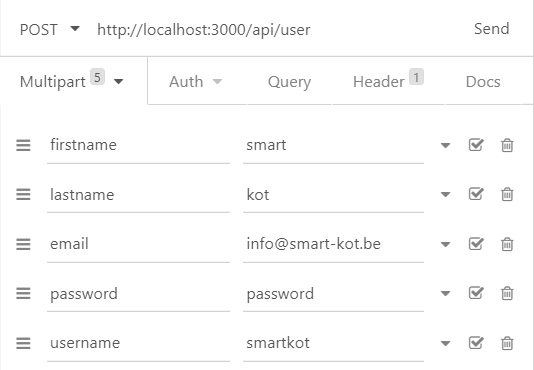

<p align="center"></p>

<p align="center">
<a href="https://travis-ci.org/laravel/framework"></a>
<p>

<p align="center">
<a href="https://travis-ci.org/laravel/framework"></a>
<p>

<p align="center">
<a href="https://packagist.org/packages/laravel/framework"></a>
<a href="https://packagist.org/packages/laravel/framework"></a>
</p>

# Smart-kot Backend API

## Information

This repo contains a full API for the Smart-kot Application. All Documentation about how to use the API can be found below. All information to install this repo now, can also found below. 

Later, all the repos will be included in docker.

## Documentation

To create an account send next information to the api server as a POST:



``` text
<server_ip>/api/user
```

## Installation guide

1. Pull the repo to your computer.

2. create a .env based on the .env.example

3. Create the tables in your database using following cmd:

``` bash
php artisan migrate
```

4. Now you can start the API by using following cmd:

``` bash
php artisan serve
```
